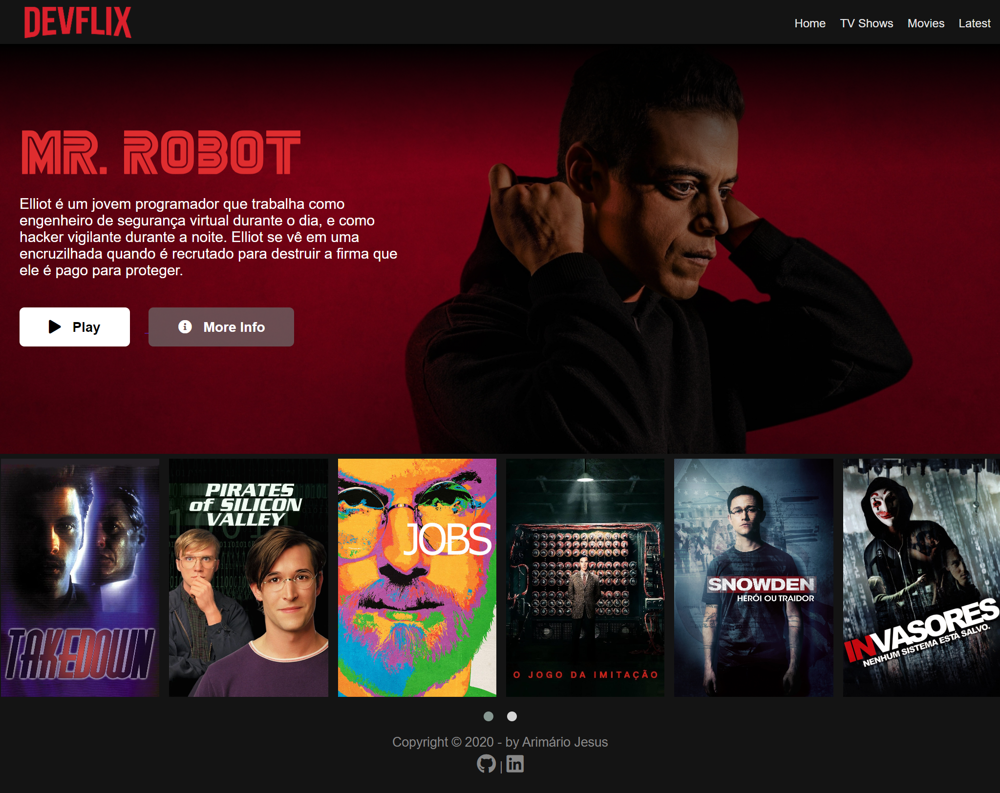
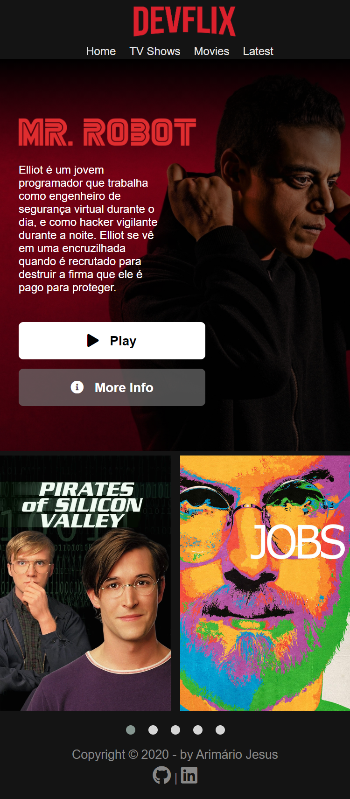

<h1 align="center">
  
</h1>

---

## 💡 About

Devflix is a clone of the famous Netflix streaming service. It was created during my studies to develop the concepts of flexbox and responsiveness, in addition to the use of the jQuery OwlCaroussel plugin.

## 🎨 Layout

### 💻 Web:

<p align="center">
  
</p>

### 📱 Mobile:

<p align="center">
  
</p>

## 💪 Contributing

Do you want to contribute? How great, I'll be happy for that 😃.

- Fork this repository.
- Create a branch with your feature: ```git checkout -b feature```
- Commit your changes: ```git commit -m "feat: My new feature```
- Push your branch: ```git push origin my-feature```

---

<p align="center">Made with ❤ by <a href="https://www.linkedin.com/in/arimario-jesus">Arimário Jesus</a></p>
